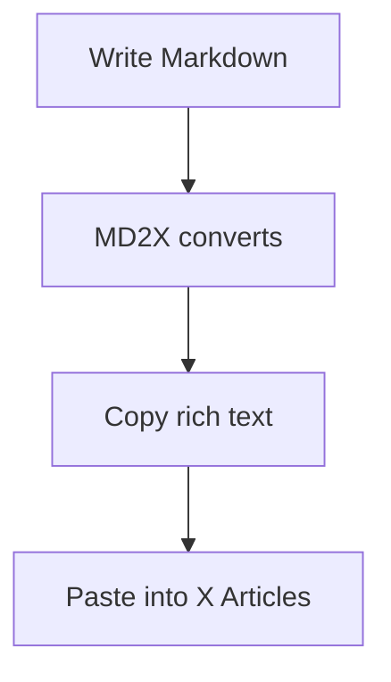

X Articles doesn't support diagrams. MD2X renders your Mermaid syntax as PNG images you can paste directly into your article — flowcharts, sequence diagrams, and more.

## The problem: no diagram support in X Articles

Technical writers often need to visualize architecture, workflows, or sequences. X Articles offers no solution:

- No native support for any diagram syntax (Mermaid, PlantUML, etc.)
- No way to embed SVGs or interactive diagrams
- Taking screenshots from external tools produces inconsistent quality
- Diagrams become outdated when you change the article — no way to regenerate
- Dark/light mode mismatches between your diagram and the article

## The solution: Mermaid diagrams as inline PNGs

MD2X renders standard Mermaid syntax into theme-aware PNG images that work perfectly in X Articles:

- **Full Mermaid.js support:** flowcharts, sequence diagrams, class diagrams, state diagrams, ER diagrams, Gantt charts
- **Theme-synced colors:** diagrams adapt to light/dark mode automatically
- **High-resolution PNG** export optimized for X Articles image display
- **Live preview** — see your diagram update as you type
- **One-click copy** from the Assets panel
- **No external tools** or accounts needed

## How to add diagrams to X Articles

### 1. Write Mermaid syntax in a code fence

Use a `` ```mermaid `` code fence and write standard Mermaid diagram syntax. Define nodes, edges, and labels using the familiar Mermaid DSL.

### 2. Preview and adjust your diagram

The live preview shows your diagram rendered in real-time. Adjust the syntax until the diagram looks right — colors automatically match your chosen theme.

### 3. Copy the PNG and paste into X Articles

Open the Assets panel, find your rendered diagram, and click "Copy Image". Paste it directly into the X Articles editor as an inline image.

## See it in action

**Mermaid syntax:**



**Result:** A clean flowchart PNG with styled nodes and arrows, theme-matched colors, and proper sizing — ready to paste into X Articles.

## Start creating diagrams for X Articles

Free, no sign-up. Write Mermaid syntax, get PNG images instantly. All rendering happens in your browser.

[Open Editor →](/editor)
