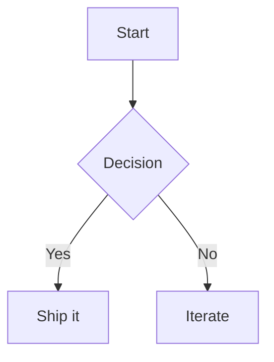

Mermaid lets you describe a diagram in plain text — but the platforms where you want to share it usually can't render Mermaid source. The fix is to export your diagram as a PNG image. This guide shows you how to do it for free, right in your browser.

## Why convert Mermaid to PNG?

Mermaid source only renders where a Mermaid engine is available — GitHub, some docs tools, and a handful of editors. Everywhere else (X Articles, slide decks, newsletters, design tools) you need an image. A PNG export gives you:

- A diagram that looks **identical everywhere**, with no renderer required
- **Crisp, high-resolution** output for retina screens and slides
- Colors that **match your theme** instead of a generic default
- A portable asset you can drop into any document

## How to convert Mermaid to a PNG

### 1. Write your diagram

Open the [MD2X editor](/editor) and add a fenced `mermaid` code block:

````markdown

````

The live preview renders the diagram as you type, so syntax errors show up immediately.

### 2. Review the rendered diagram

Check the preview panel. Diagram colors are synced to your active theme, so the result looks right in both light and dark mode.

### 3. Copy or download the PNG

The rendered diagram appears in the Assets panel. Copy it to your clipboard or download the PNG to embed in your article, slides, or docs.

## Supported diagram types

MD2X renders everything Mermaid supports: flowcharts, sequence diagrams, class diagrams, state diagrams, entity-relationship diagrams, and Gantt charts.

## Start rendering

Ready to turn your Mermaid source into a shareable image? [Open the Mermaid-to-PNG tool →](/mermaid-to-png)
